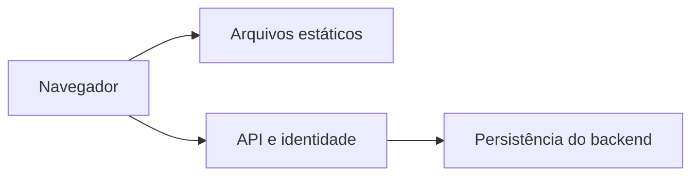
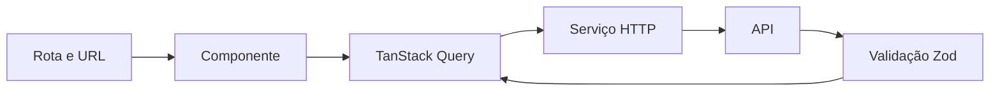

# Arquitetura

## Escopo

Sistemas internos, portais e painéis autenticados com uma API separada. Requisitos assumidos: publicação estática, organização por domínio, uso por várias aplicações e baixo custo de adoção. Sites públicos com SEO/SSR exigem reavaliar a fundação.

## Escolha da base

| Opção | Benefício | Custo | Quando usar |
|---|---|---|---|
| React + Vite + TanStack Router | Um build estático; mantém o ecossistema já usado no projeto de referência | Convenções de dados, sessão e testes mantidas pelo template | Escolhida para aplicações internas com backend separado |
| TanStack Start em SPA | Caminho integrado para recursos de servidor e pré-renderização | Acrescenta build/pré-renderização de servidor à base | Quando há demanda concreta de rotas renderizadas no servidor |
| Framework com SSR como requisito central | Integra renderização e servidor | Mais decisões de hospedagem e fronteiras cliente/servidor | Produtos públicos cuja indexação ou renderização inicial demande SSR |

Esta escolha é para o novo template; o uso de Start no projeto original é uma decisão válida e documentada. Não há ganho em reescrever aquele projeto só por esta escolha.



## Pastas

```text
src/
  config/             identidade, formatação e navegação
  routes/             URL, composição das telas e sessão exigida
  features/
    auth/             contrato de sessão e login/logout
    items/            exemplo de funcionalidade, removível
      api/            serviços, consultas/chaves e mutações
      components/     componentes do domínio
      types/          esquemas Zod e tipos inferidos
      tests/          comportamento do módulo
      index.ts        contrato público
  shared/
    api/              HTTP, erros e QueryClient
    components/ui/    primitivas shadcn/Base UI
    components/       composição comum de aplicação
    hooks/            comportamento compartilhado
    lib/              formatação e utilitários
  mocks/              simulação exclusiva do desenvolvimento/testes
e2e/                  jornadas Playwright
scripts/              criação de novos projetos
```

Pastas só são criadas quando usadas. Um módulo pequeno pode ter menos arquivos. A rota pode compor uma tela inteira; extraia componentes quando houver responsabilidade ou reutilização concreta.

## Dados e React



- Query armazena dados remotos; não duplique respostas em contexto, store ou `useState`.
- Campos pertencem ao TanStack Form. Filtros, ordenação e página pertencem à URL.
- Contexto React é usado para tema. Não há store global adicional sem necessidade.
- Serviços recebem o AbortSignal, validam JSON e tratam IDs com `encodeURIComponent`.
- O cliente HTTP não repete chamadas; Query repete uma leitura em falha transitória. Respostas inválidas e 4xx não são repetidos. Escritas nunca são repetidas automaticamente.
- As mutações invalidam apenas o domínio afetado. O exemplo espera confirmação do servidor antes de anunciar sucesso.
- Navegação entre rotas usa divisão automática de código. A experiência de erro e carregamento é explícita.
- Use memoização quando houver cálculo ou identidade que justifique o custo; não é requisito de todo componente.
- Formulários, tabelas e navegação têm nomes acessíveis. O layout inclui acesso direto ao conteúdo e menu móvel.

## Fronteiras e manutenção

O Biome bloqueia imports por alias para o interior de outro domínio. Imports relativos atravessando módulos precisam ser evitados na revisão; a regra não substitui análise de dependências. `shared` recebe dados e ações da rota, sem conhecer `features`.

Nome, cores e menu são pontos de configuração concretos. Não há um motor genérico de CRUD, contêiner de injeção, sistema de plugins, monorepo ou biblioteca de componentes publicada. Essas opções acrescentariam manutenção sem requisitos atuais.

Se várias aplicações passarem a precisar das mesmas correções de componentes, avalie extrair uma biblioteca versionada. Até lá, cada cópia evolui independentemente, com a origem das melhorias registrada no changelog.

## Referências consultadas

- [React: criar uma aplicação](https://react.dev/learn/build-a-react-app-from-scratch)
- [TanStack Router com Vite](https://tanstack.com/router/latest/docs/installation/with-vite)
- [Divisão automática de código](https://tanstack.com/router/latest/docs/guide/automatic-code-splitting)
- [TanStack Start em SPA](https://tanstack.com/start/latest/docs/framework/react/guide/spa-mode)
